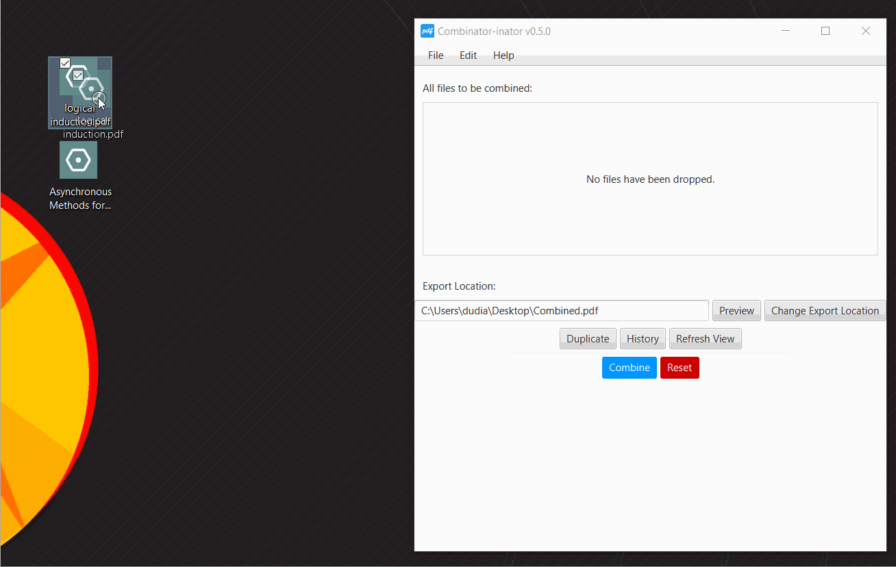
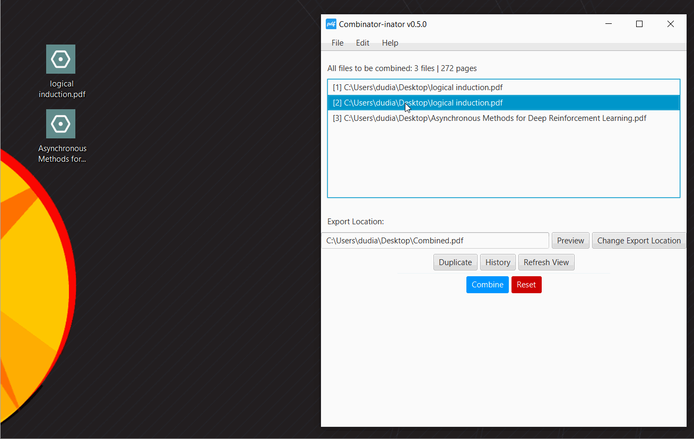
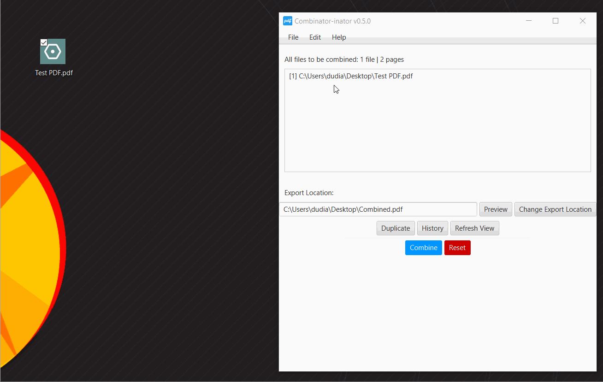
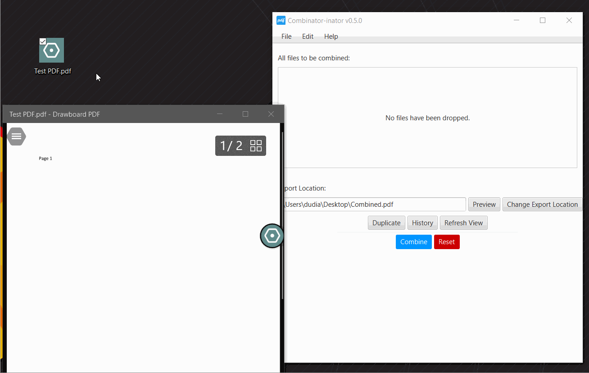
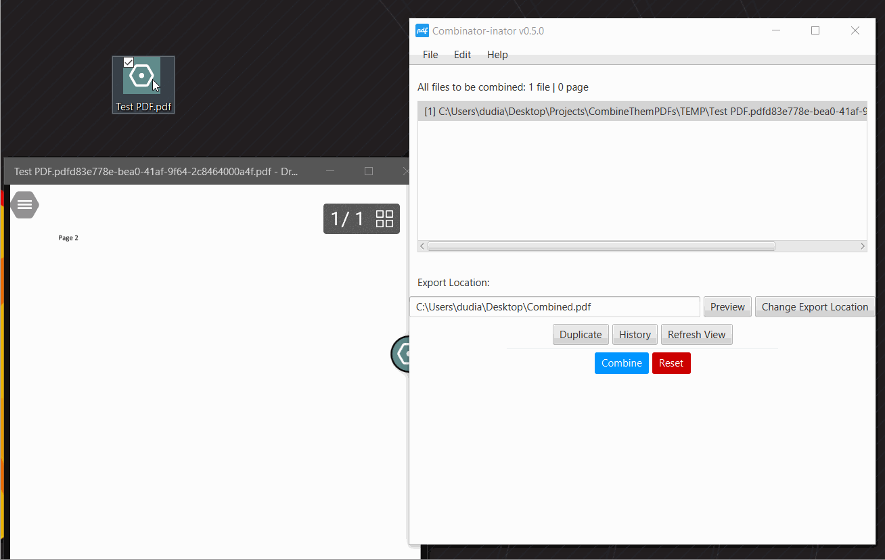
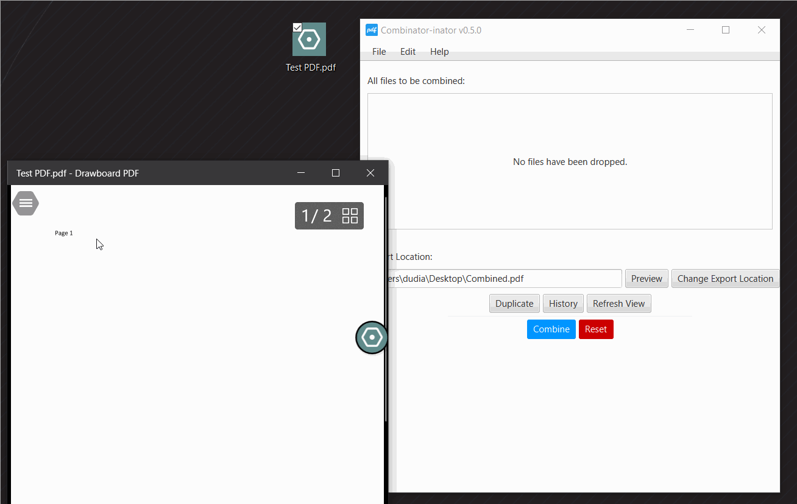
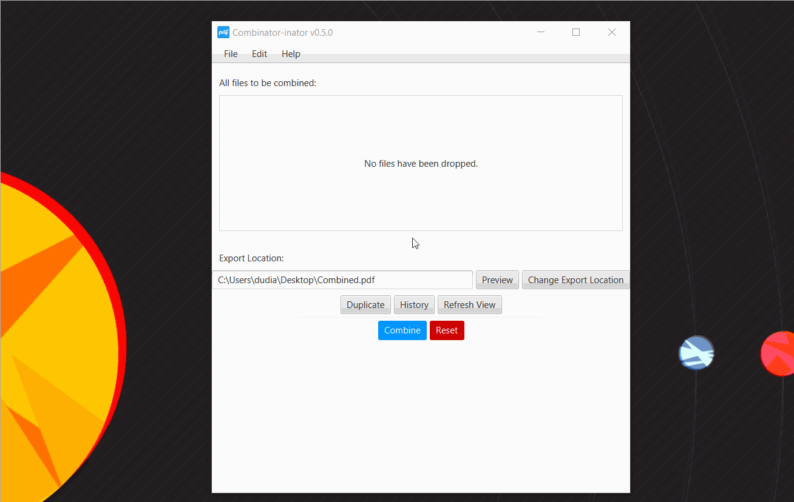

Combine Them PDFs
------
Application utilizing [SQLite](https://www.sqlite.org/index.html), [JavaFX](https://en.wikipedia.org/wiki/JavaFX), [PDFBox](https://pdfbox.apache.org/) and [documents4j](https://documents4j.com/#/).
This [drag-and-drop](https://docs.oracle.com/javafx/2/drag_drop/jfxpub-drag_drop.htm) application takes in a list of [PDF](https://en.wikipedia.org/wiki/PDF) files and combines/merge them into one file. 
If a file is a Word document or [DOCX](https://www.howtogeek.com/304622/what-is-a-.docx-file-and-how-is-it-different-from-a-.doc-file-in-microsoft-word/) 
then it converts it to a [PDF](https://en.wikipedia.org/wiki/PDF) file on a temporary location relative to where the application is being ran and uses the 
new [PDF](https://en.wikipedia.org/wiki/PDF) file location instead of the [DOCX](https://www.howtogeek.com/304622/what-is-a-.docx-file-and-how-is-it-different-from-a-.doc-file-in-microsoft-word/)
location. Conversion from [DOCX](https://www.howtogeek.com/304622/what-is-a-.docx-file-and-how-is-it-different-from-a-.doc-file-in-microsoft-word/)
 to [PDF](https://en.wikipedia.org/wiki/PDF) does not work in [macOS](https://en.wikipedia.org/wiki/MacOS) 
 nor [Linux](https://en.wikipedia.org/wiki/Linux).
 
WARNING
------
CLOSE AND SAVE ALL DOCUMENTS THAT YOU ARE CURRENTLY WORKING ON IN WORD BEFORE USING THIS APPLICATION. IF YOU FAIL TO DO SO IT WILL DELETE ALL UNSAVED WORK IN WORD.

How to Use the Program
----

### Importing files

To import a file into the application, it must be dragged and dropped in.

### Move a file

When you right-click a file, you will be prompted with a dialog box. Select Move the program will automatically select the first file for you, you'll just have to select the position where you want the file to be. It will no delete any file in that position, only move it.

### Remove a file
When you right-click a file, you will be prompted with a dialog box. Select Remove From List the program will automatically select the file location for you, you'll just have to confirm.

### Open a file

You can open a file in the list by double-clicking or by right-clicking the file and choosing Open File.

### Remove a page from a file

Before you continue, this will not edit the original file. The program will create a temporary copy of the file and edit that. Like before, you just simply have to right-click the file and select Remove a Page, and then you'll be prompted again for the page number.

### Preview

Simply click the Preview button. It will create a temporary file.

### Export Content

Simply click the Combine button, the file will appear at the export location (Desktop by default).

### History

The program stores locally (doesn't send anything to a server) the files used for previous exports. So, you could recover previously used files just in case you would want to change something (or forgot there was a preview button). Simply, select a saved state, it will show on the right all the files used for the that saved state. If you have any files in the program already it will ask you if you will like to add the saved state (i.e., the list of files) to it. If not, you'll have to manually delete the recently imported file. The erase button cannot be undone, this will delete all temporary files, and therefore the saved states.

What I learned
------
- Merging [PDF](https://en.wikipedia.org/wiki/PDF) files with [PDFBox](https://pdfbox.apache.org/).
- Converting [Word document](https://www.howtogeek.com/304622/what-is-a-.docx-file-and-how-is-it-different-from-a-.doc-file-in-microsoft-word/) 
files to [PDF](https://en.wikipedia.org/wiki/PDF) with [documents4j](https://documents4j.com/#/).
- Manual [JavaFX](https://en.wikipedia.org/wiki/JavaFX) styling and setup.
- [Drag and drop](https://docs.oracle.com/javafx/2/drag_drop/jfxpub-drag_drop.htm) functionality in [JavaFX](https://en.wikipedia.org/wiki/JavaFX).
- Extensive String manipulation.
- SQLite implementation
